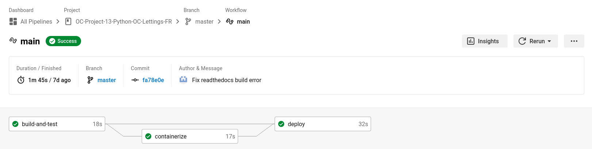

Description des API
===================

Ce projet Django s'appuie sur un ensemble d'interfaces de programmation (API) bien définies qui facilitent la gestion, la collaboration et le déploiement de l'application. Ces API sont au cœur de notre pile technologique et garantissent un fonctionnement fluide de bout en bout.

Les APIs dans Django
--------------------
Django lui-même est livré avec de nombreuses API. Expliquer chacun d’eux sort du cadre de cette documentation. Cependant, vous pouvez lire tous les détails dans la `documentation officielle`_ si nécessaire.

Docker
------
Docker est utilisé pour conteneuriser notre application. L'API Docker permet la gestion programmatique des conteneurs. Il joue un rôle crucial dans la création, la mise à l'échelle et la gestion des conteneurs pour nos services.

Docker peut créer des images automatiquement en lisant les instructions d'un Dockerfile. Un Dockerfile est un document texte qui contient toutes les commandes qu'un utilisateur peut appeler sur la ligne de commande pour assembler une image. Voici celui que nous utilisons :

.. _dockerfile:

.. code-block:: docker

    # Defines the base image to use
    FROM python:3.10-alpine

    # Setup python environment variables
    # Python won’t try to write .pyc files on the import of source modules
    ENV PYTHONDONTWRITEBYTECODE 1
    # Non-empty buffer to show the output of the app in real time
    ENV PYTHONUNBUFFERED 1

    # Ensure latest pip and run pip commands as user
    RUN pip install --upgrade pip

    RUN adduser -D myuser
    USER myuser
    WORKDIR /home/myuser
    ENV PATH "$PATH:/home/myuser/.local/bin"

    # Configure Django environment variables
    ENV SECRET_KEY $SECRET_KEY
    ENV DEBUG $DEBUG
    ENV SENTRY_DSN $SENTRY_DSN
    ENV ALLOWED_HOSTS $ALLOWED_HOSTS

    # Build arguments
    ARG VERSION
    ENV VERSION $VERSION
    ARG BUILD_TIMESTAMP
    ENV BUILD_TIMESTAMP $BUILD_TIMESTAMP

    # Install dependencies and copy the application files
    COPY --chown=myuser:myuser requirements.txt requirements.txt
    RUN pip install --user --no-cache-dir -r requirements.txt
    COPY --chown=myuser:myuser . .

    # Run Django server with the port opened by heroku after collecting static files
    CMD python3 manage.py collectstatic --noinput && python3 manage.py runserver 0.0.0.0:$PORT

.. note:: Vous avez besoin d'un compte DockerHub si vous souhaitez pull ou push des images Docker (`la page de connexion <https://hub.docker.com/signup>`_).

.. _circleci-description:

CircleCI
--------
CircleCI est utilisé pour la configuration de notre pipeline CI/CD. Il build, teste et déploie en utilisant une automatisation intelligente. Un dépôt de logiciels sur un système de contrôle de version pris en charge (GitHub dans notre cas) doit être autorisé et ajouté en tant que projet sur `circleci.com`_. Chaque changement de code déclenche ensuite des tests automatisés dans un conteneur ou une machine virtuelle propre. CircleCI exécute chaque tâche dans un conteneur ou une machine virtuelle distinct.

Le point crucial pour connecter CircleCI à notre projet est un ``config.yml``, qui se trouve dans un répertoire ``.circleci``. Ce fichier de configuration ``yaml`` pour CircleCI déclenche le workflow complet sur chaque demande push ou pull sur la branche principale (``master``). Les requêtes push et pull sur les autres branches déclenchent uniquement le workflow de construction et de test (:ref:`le fichier de configuration CircleCI <circleci-config>`).

Voici exemple d'un workflow sur l'interface de CircleCI :

Sentry
------
Sentry est notre plateforme de gestion d’erreurs en temps réel. Son API nous permet de surveiller activement les erreurs et les exceptions dans notre application, ce qui facilite la détection et la correction rapides des problèmes. Les rapports d’erreurs envoyés via cette API sont précieux pour le débogage.

Pour l'integration nous avons les lignes de codes suivantes dans le fichier ``oc_lettings_site/settings.py`` :

.. code-block:: python 
    
    import sentry_sdk

    from sentry_sdk.integrations.django import DjangoIntegration

    # Sentry configuration
    sentry_sdk.init(
        dsn=env("SENTRY_DSN"),
        integrations=[DjangoIntegration()],
        # Set traces_sample_rate to 1.0 to capture 100%
        # of transactions for performance monitoring.
        # We recommend adjusting this value in production.
        traces_sample_rate=1.0,
        # If you wish to associate users to errors (assuming you are using
        # django.contrib.auth) you may enable sending PII data.
        send_default_pii=True,
    )

La valeur de ``SENTRY_DSN`` doivent configurer dans le fichier ``.env``. 

Pour avoir cette valeur, `créer un compte Sentry <https://sentry.io/signup/>`_, ensuite créer un projet pour l'application. Le ``SENTRY_DSN`` sera disponible dans ``Project Settings > Client Keys (DSN)``.

.. _heroku-description:

Heroku
------

Heroku est notre plateforme d’hébergement cloud pour l’application. L’API Heroku est utilisée pour gérer les ressources de l’application, notamment le scaling automatique, le déploiement continu et la surveillance des performances.

Pour l'utiliser il faut un `compte Heroku <https://signup.heroku.com/dc>`_, `Heroku CLI <https://devcenter.heroku.com/articles/heroku-cli#install-the-heroku-cli>`_ installé, Git installé et un fichier texte dans le répertoire racine de votre application nommé ``Procfile`` sans extension de fichier.

Le ``Procfile`` indique à Heroku quelle(s) commande(s) exécuter pour démarrer l'application. Voici notre ``Procfile`` :

.. code-block::

    web: gunicorn oc_lettings_site.wsgi

Ce ``Procfile`` utilise Gunicorn, le serveur web de production que nous avons choisi pour les applications Django.

.. _documentation officielle: https://docs.djangoproject.com/fr/3.0/ref/
.. _circleci.com: https://circleci.com/
