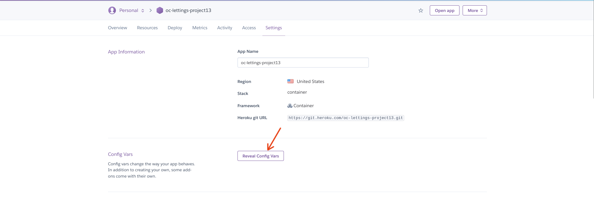
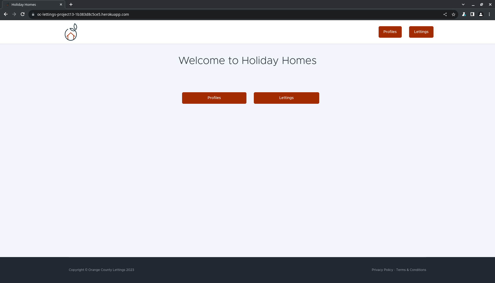

.. _deployment-procedures:

Procédures de déploiement
=========================

Une fois nos versions d'application exécutées, nous devrons déployer l'application pour pouvoir la voir en ligne.

Déploiement manuel
------------------

Pour déployer notre image Docker depuis notre machine de développement, nous devons avoir :

* `Un compte Heroku vérifié <https://devcenter.heroku.com/articles/account-verification>`_
* `Heroku CLI installé <https://devcenter.heroku.com/articles/heroku-cli#install-the-heroku-cli>`_
* `Démon Docker <https://docs.docker.com/config/daemon/start/>`_
* Lu le chapitre :ref:`heroku-description`

Suivez les étapes pour déploiement :

1. Tout d’abord, vous devrez créer l’application dans Heroku, en utilisant le site Web Heroku. Pour créer une application rendez-vous sur le Dashboard, cliquez sur *New* et *Create new app*.

2. Après cela, vous devrez vous connecter à Heroku depuis votre terminal ou cmd avec la commande suivante :

.. code-block:: bash

    heroku login

Après avoir exécuté cette commande, un navigateur s'ouvrira et vous amènera au site Web Heroku pour vous authentifier. Une fois que vous avez terminé, vous serez de retour sur votre terminal, connecté.

3. Ensuite, vous devrez vous connecter au registre de conteneurs Heroku :

.. code-block:: bash

    heroku container:login

Aucune information d'identification ne sera demandée pour le moment.

.. _heroku-config-vars: 

4. Configurez les variables d'environnements suivant dans le site Heroku dans la partie *Settings* allez dans *Config Vars* :

.. code-block:: bash

    SECRET_KEY
    SENTRY_DSN
    DEBUG
    ALLOWED-HOSTS

5. Maintenant, pour créer notre image Docker et la transmettre à Heroku, exécutez :

.. code-block:: bash

    heroku container:push -a <heroku-app-name> web

Vous devez disposer du Dockerfile à la racine du projet pour pouvoir créer l'image.

6. Enfin, lorsque l'image a été poussée avec succès, vous devez faire la release :

.. code-block:: bash

    heroku container:release -a <heroku-app-name> web

Livraison continue (CD)
-----------------------

Pour automatiser le pipeline de déploiement ci-dessus, pour lancer une nouvelle version de notre application à chaque fois qu'une validation est effectuée dans la branche principale. Vous devez créer un nouveau ``job`` dans la configuration CircleCI. Voir la partie ``deploy`` dans :ref:`CircleCI config <circleci-config>`.

Ce que font les commandes du ``job`` sur l'image de construction Docker CircleCI est :

1. Installer Heroku CLI sur la machine de construction :

.. code-block:: bash

    sudo curl https://cli-assets.heroku.com/install.sh | sh

2. Se connecter au registre Heroku en passant notre clé API Heroku comme paramètre pour ne pas avoir besoin de vous authentifier avec la commande de connexion Heroku. (Contourner la connexion au navigateur) :

.. code-block:: bash

    HEROKU_API_KEY=${HEROKU_API_KEY} heroku container:login

3. Transmettre les valeurs des variables d'environnement ou vous pouvez faire comme dans :ref:`l'explication ci-dessus <heroku-config-vars>` :

.. code-block:: bash

    HEROKU_API_KEY=${HEROKU_API_KEY} heroku config:set SECRET_KEY=$SECRET_KEY -a $HEROKU_APP_NAME
    HEROKU_API_KEY=${HEROKU_API_KEY} heroku config:set SENTRY_DSN=$SENTRY_DSN -a $HEROKU_APP_NAME
    HEROKU_API_KEY=${HEROKU_API_KEY} heroku config:set DEBUG=$DEBUG -a $HEROKU_APP_NAME
    HEROKU_API_KEY=${HEROKU_API_KEY} heroku config:set ALLOWED-HOSTS=$ALLOWED-HOSTS -a $HEROKU_APP_NAME

4. Construire et transférer notre image Docker vers le registre Heroku :

.. code-block:: bash

    HEROKU_API_KEY=${HEROKU_API_KEY} heroku container:push -a $HEROKU_APP_NAME web

5. Sortie de la nouvelle version de notre application :

.. code-block:: bash

    HEROKU_API_KEY=${HEROKU_API_KEY} heroku container:release -a $HEROKU_APP_NAME web

.. note:: Le jeton Heroku, HEROKU_API_KEY, est disponible dans les paramètres du compte avec le nom *Heroku API Key*. Il ne faut pas oublier d'ajouter cette variable dans les variables d'environnement CircleCI (voir comment faire sur la partie `Définir les variables d'environnement <https://circleci.com/docs/set-environment-variable/#set-an-environment-variable-in-a-project>`_ de la documentation CircleCI )..

L'application publiée sera disponible à partir du tableau de bord Heroku en cliquant sur le bouton « Open app ». Exemple :

