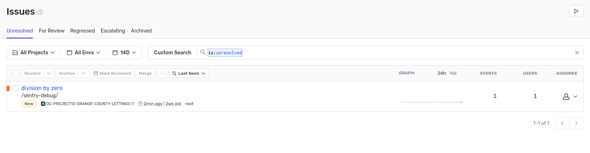

Guide d’utilisation
===================

Linting
-------
Le projet utilise le module flake8 pour linting. Flake8 a été configuré pour permettre une longueur maximale de ligne de code jusqu'à 99 caractères. Et il ne lintera pas dans les dossiers de migrations et d’environnement virtuel. Ces comportements sont obtenus grâce à des lignes suivantes du fichier ``setup.cfg`` :

.. code-block:: cfg

    [flake8]
    max-line-length = 99
    exclude = **/migrations/*,venv, env

Exécutez le linting à l'aide des commandes suivantes :

.. code-block:: bash

    # Déplacer à la racine du dossier
    cd path/to/the/folder/OC-Project-13-Python-OC-Lettings-FR
    # Activer l'environnement virtuel
    source venv/bin/activate
    # Faire le linting
    flake8

Tests unitaires
----------------
Le projet utilise le module pytest pour les tests. Les tests correspondant à chaque application (home, lettings et profiles) sont regroupés dans des dossiers de mêmes noms sous le dossier ``tests/unit_tests``. Les tests unitaires sont écrits avec des classes.

La configuration pytest peut être vue dans le fichier ``setup.cfg`` sous la ligne ``[tool:pytest]``.

Lancez des tests à l'aide des commandes suivantes :

.. code-block:: bash

    # Déplacer à la racine du dossier
    cd path/to/the/folder/OC-Project-13-Python-OC-Lettings-FR
    # Activer l'environnement virtuel
    source venv/bin/activate
    # Lancer le test
    pytest

Couverture de test
------------------
Le projet utilise Coverage.py et pytest-cov (plugin Coverage.py pour pytest) pour une meilleur lecture de la couverture.

La configuration de la couverture, comme les fichiers à exclure, se trouve dans le fichier ``.coveragerc``.

Pour voir le rapport de couverture sur le terminal :

.. code-block:: bash

    # Déplacer à la racine du dossier
    cd path/to/the/folder/OC-Project-13-Python-OC-Lettings-FR
    coverage report -m

Pour voir le rapport avec un rapport de test :

.. code-block:: bash

    # Déplacer à la racine du dossier
    cd path/to/the/folder/OC-Project-13-Python-OC-Lettings-FR
    pytest --cov=.

Utilisation de Sentry 
---------------------

1. **Configuration**

Pour utiliser Sentry et pouvoir utiliser le monitoring sur le projet accédé à votre compte (si vous n'en avez pas encore une, `créer un compte Sentry <https://sentry.io/signup/>`_).

    * Créer un nouveau projet

    * Choisissez une plateforme pour le projet, dans notre cas Django.

    * Choisissez une équipe pour votre projet ensuite cliquer sur : Créer un projet

    * Une fois le projet créé, vous pourrez récupérer la clé ``SENTRY_DSN`` dans ``Project Settings > Client Keys (DSN)`` à intégrer dans le fichier ``.env``

Une fois toutes ces étapes exécutées et le serveur local lancer, vous pourrez visualiser sur Sentry l’activité de l’application.

La journalisation Sentry peut être testée en naviguant vers ``/sentry-debug/``, localement et sur l'application déployée via ``https://<HEROKU_APP_NAME>-<IDENTIFIER>.herokuapp.com/sentry-debug/``. Ce point de terminaison provoque une ``ZeroDivisionError``. Voici un exemple :

.. note:: Pour collaborer sur un projet, vous devez créer des équipes et accorder des autorisations dans la configuration Sentry. Consultez `la documentation officielle de Sentry <https://docs.sentry.io/product/accounts/membership/>`_ pour plus de détails.

2. **Logging**

Pour compléter la gestion des erreurs en insérant des logs appropriés dans le code, ce projet utilise le module de logging de Python. Le logging Python est prise en charge par Sentry avec le module ``sentry-sdk`` installé. Ces logs doivent être placés aux endroits stratégiques du code, tels que les fonctions critiques, les blocs try/except et les points de validation des données.

Voici un extrait de code depuis le projet (``lettings/views.py``). Notez la partie ``except`` pour l'exemple de l'utilisation de ``logging`` :

.. code-block:: python

    def letting(request, letting_id):
    """Detailed view of a letting.
    Parameters:
    letting_id (int): id of a letting"""
        try:
            letting = get_object_or_404(Letting, id=letting_id)
            context = {
                "title": letting.title,
                "address": letting.address,
            }
            return render(request, "lettings/letting.html", context)
        except Exception as e:
            logging.error(str(e))
            return render(request, "error.html", {"message": str(e)}, status=404)

Voyez lire `la documentation officielle <https://docs.sentry.io/platforms/python/integrations/logging/>`_ pour plus d'exemple.

Utilisation de Docker
----------------------

Construire et taguer une image du site
^^^^^^^^^^^^^^^^^^^^^^^^^^^^^^^^^^^^^^

    1. `Téléchargez et installez Docker <https://docs.docker.com/get-docker/>`_ 

    2. Accédez au répertoire du projet :
    
    .. code-block:: bash

        cd path/to/the/folder/OC-Project-13-Python-OC-Lettings-FR

    3. Assurez-vous que le ``Dockerfile`` et le ``.dockerignore`` (ce fichier est utilisé pour exclure les dossiers inutiles comme venv lors de la création de l'image) sont présents dans le répertoire.

    4. Assurez-vous que le fichier ``.env`` a été préalablement créé (voir :ref:`create-venv`)

    5. Construisez l'image  avec le nom de l'image souhaitée :

    .. code-block:: bash

        docker build -t <image-name> .

Pousser l'image vers le DockerHub
^^^^^^^^^^^^^^^^^^^^^^^^^^^^^^^^^

    1. Créer un compte sur DockerHub (`la page de connexion <https://hub.docker.com/signup>`_).

    2. Connectez-vous avec la commande suivante :

    .. code-block:: bash 

        docker login --username <username> --password-stdin
    
        Vous pouvez taper le mot de passe ensuite dans le terminal.

    3. Pousser l'image :

    .. code-block:: bash 

        docker push <image-name>

.. _run-website-docker:

Lancer le site localement avec une image Docker
^^^^^^^^^^^^^^^^^^^^^^^^^^^^^^^^^^^^^^^^^^^^^^^

Il y a trois façons pour lancer le site avec une image Docker.

    * Avec l'image que vous avez construit :

        1. Lancer un conteneur docker avec l'image que vous avez construit :

        .. code-block:: bash 

            docker run --env-file .env --name <container_name> -p 8000:8000 -it -d <image_name>
        
        Le fichier ``.env`` est nécessaire pour la valeur ``PORT`` dans le ``Dockerfile``
        
        2. Accédez le site dans un navigateur à http://0.0.0.0:8000/.

    * Avec la dernière image disponible du registre DockerHub

        1. Connectez-vous avec la commande suivante :

        .. code-block:: bash 

            docker login --username <username> --password-stdin
        
        2. Extraire la dernière image :

        .. code-block:: bash 

            docker pull <image_name>
        
        3. Lancer un conteneur docker :

        .. code-block:: bash 

            docker run --env-file .env --name <container_name> -p 8000:8000 -it -d <image_name>
                
        4. Accédez le site dans un navigateur à http://0.0.0.0:8000/.

    * Utiliser le script Bash ``run_latest_docker_image_locally.sh`` comme ceci :

        1. Donner la permission au script de s'exécuter :

        .. code-block:: bash 
            
            chmod +x path/to/run_latest_docker_image_locally.sh

        2. Executer le script :

        .. code-block:: bash

            ./run_latest_docker_image_locally.sh
        
        .. note:: Si vous êtes sur Windows, il faut lancer ceci dans `le shell Bash pour Windows <https://learn.microsoft.com/fr-fr/windows/wsl/install>`_.

Utilisation de CircleCI
-----------------------

Le compte CircleCI est connecté au dépôt GitHub. Pour créer un projet de la même manière, suivez `les étapes de la documentation circleCI <https://circleci.com/docs/getting-started/#>`_.

Au lieu de l'étape de création automatique du fichier de configuration, vous pouvez utiliser celui qui se trouve à la racine du dépôt (voir `étape 4 <https://circleci.com/docs/getting-started/#>`_ dans la documentation).

Comme indiquer dans la partie :ref:`circleci-description` Le point crucial pour connecter CircleCI à notre projet est un ``config.yml``, qui se trouve dans un répertoire ``.circleci``. Ce fichier de configuration ``yaml`` pour CircleCI déclenche le workflow complet sur chaque demande push ou pull sur la branche principale (``master``). Les requêtes push et pull sur les autres branches déclenchent uniquement le workflow de construction et de test.

Une fois le projet prêt. Il faut ajouter les variables d'environnement suivantes dans les paramètres du projet CircleCI (voir la partie `Définir les variables d'environnement <https://circleci.com/docs/set-environment-variable/#set-an-environment-variable-in-a-project>`_ de la documentation CircleCI pour les détails) :

.. code-block::

    # SECURITY WARNING: don't run with the debug turned on in production!
    DEBUG

    # SECURITY WARNING: keep the secret key used in production secret!
    SECRET_KEY

    # Allowed hosts
    ALLOWED_HOSTS

    # Sentry api key
    SENTRY_DSN

    # Docker hub credentials: username
    DOCKER_USER

    # DockerHub credentials: password
    DOCKER_PASSWORD

    # DockerHub repository name
    DOCKER_REPO

    # Jeton Heroku, disponible dans les paramètres du compte (Heroku API Key)
    HEROKU_API_KEY

    # Heroku app name
    HEROKU_APP_NAME

.. note:: Ces valeurs doivent correspondre à celles de votre fichier ``.env``.

CI/CD pipeline
^^^^^^^^^^^^^^^

Le fichier de configuration CircleCI du projet (`.circleci/config.yml`) :

.. _circleci-config:

.. code-block:: yaml

    version: 2.1

    jobs:
    build-and-test:
        docker:
        - image: cimg/python:3.10.11
        resource_class: small
        steps:
        - checkout # fetches your source code over SSH to the configured path
        - restore_cache: # restores a previously saved cache
            key: deps1-{{ .Branch }}-{{ checksum "requirements.txt" }}
        - run:
            name: Initialize venv / Install deps
            command: |
                python -m venv venv
                . venv/bin/activate
                pip install -r requirements.txt
        - save_cache:
            key: deps1-{{ .Branch }}-{{ checksum "requirements.txt" }}
            paths:
                - ".venv"
        - run:
            name: Run tests
            command: |
                . venv/bin/activate
                pytest
        - run:
            name: Run coverage tests
            command: |
                . venv/bin/activate
                pytest --cov=.
                coverage report --fail-under=80

        - run:
            name: Linting
            command: |
                . venv/bin/activate
                flake8
    
    containerize:
        docker:
        - image: cimg/python:3.10.11
        resource_class: medium
        steps:
        - checkout
        - setup_remote_docker
        - run:
            name: Containerize
            command: |
                echo "$DOCKER_PASSWORD" | docker login --username $DOCKER_USER --password-stdin
                VERSION=$CIRCLE_SHA1
                TAG="$DOCKER_REPO:$VERSION"
                LATEST="${DOCKER_REPO}:latest"
                BUILD_TIMESTAMP=$( date '+%F_%H:%M:%S' )
                docker build -t "$TAG" -t "$LATEST" --build-arg VERSION="$VERSION" --build-arg BUILD_TIMESTAMP="$BUILD_TIMESTAMP" .
                docker push "$TAG" 
                docker push "$LATEST"
    
    deploy:
        machine:
        image: ubuntu-2004:202010-01
        resource_class: medium
        steps:
        - checkout
        - run:
            name: Deploy Docker image to Heroku
            command: |
                sudo curl https://cli-assets.heroku.com/install.sh | sh
                HEROKU_API_KEY=${HEROKU_API_KEY} heroku container:login
                HEROKU_API_KEY=${HEROKU_API_KEY} heroku config:set SECRET_KEY=$SECRET_KEY -a $HEROKU_APP_NAME
                HEROKU_API_KEY=${HEROKU_API_KEY} heroku config:set SENTRY_DSN=$SENTRY_DSN -a $HEROKU_APP_NAME
                HEROKU_API_KEY=${HEROKU_API_KEY} heroku config:set DEBUG=$DEBUG -a $HEROKU_APP_NAME
                HEROKU_API_KEY=${HEROKU_API_KEY} heroku config:set ALLOWED-HOSTS=$ALLOWED-HOSTS -a $HEROKU_APP_NAME
                HEROKU_API_KEY=${HEROKU_API_KEY} heroku container:push -a $HEROKU_APP_NAME web
                HEROKU_API_KEY=${HEROKU_API_KEY} heroku container:release -a $HEROKU_APP_NAME web

    workflows:
    main:
        jobs:
        - build-and-test
        - containerize:
            requires:
                - build-and-test
            filters:
                branches:
                only:
                    - master
        - deploy:
            requires:
                - build-and-test
                - containerize
            filters:
                branches:
                only:
                    - master

Le fichier de configuration contient trois *jobs* dans l'ordre suivant :

1. Construire et tester (build and test)

    * ``checkout`` : CircleCI récupère le code source via SSH vers un chemin configuré (le répertoire de travail, par défaut).
    * ``restore_cache`` : restaure un cache précédemment enregistré.
    * ``run`` : exécute les commandes dans la partie ``command``, ici créer et activer le ``venv``. Ensuite, installer des dépendances.
    * ``save_cache`` : génère et enregistre un cache d'un fichier, de plusieurs fichiers ou dossiers. Dans notre cas, nous sauvegardons un cache des packages Python installés obtenus à l'étape précédente.
    * Ensuite, il exécute les tests unitaires et le passe seulement si la couverture de tests est supérieur à 80.
    * Enfin, il vérifie si le linting passe sans erreurs.

2. Conteneuriser (containerize)

    * ``setup_remote_docker`` : permet d'exécuter les commandes Docker localement.
    * Les commandes font ce qui suit :
        1. Connexion utilisateur avec configuration des informations d'identification DockerHub à partir des variables d'environnement dans les paramètres du projet.
        2. Définir les variables pour stocker les arguments de construction et le nom de l'image. Les arguments de construction sont ``VERSION`` et ``BUILD_TIMESTAMP``. Il donne deux noms d'image, ``TAG`` et ``LATEST``, tous deux sont construits à partir de la variable d'environnement ``DOCKER_REPO``, ``TAG`` ajoute la ``VERSION`` au nom du dépôt Docker et le second ajoute le mot-clé « latest ». Notez que ``CIRCLE_SHA1`` est une variable d'environnement intégrée de CircleCI. Quel est le hachage SHA1 du dernier commit de la version actuelle.
        3. Construction d'image avec ``docker build``
        4. Pousser l'image avec ``TAG`` comme nom, ensuite ``LATEST``

    .. note:: Afin de recevoir les arguments de construction (``VERSION`` et ``BUILD_TIMESTAMP``) dans le Dockerfile et de les transmettre en tant que variables d'environnement à l'image, il faut les ajouter au Dockerfile (voir :ref:`le fichier Dockerfile <dockerfile>`).

3. Déployer (deploy)

Voir la partie :ref:`deployment-procedures` pour l'explication.

.. note:: Pour voir un tableau de bord privé CircleCI vous avez besoin d'un lien d'invite (voir plus de détails sur la `documentation CircleCI`_) et pour voir un tableau de bord public CircleCI vous avez besoin de s'authentifier (`la page de connexion CircleCI <https://circleci.com/signup/>`_).

.. _documentation CircleCI: https://circleci.com/docs/first-steps/#sign-up-with-an-invite